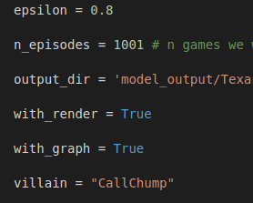
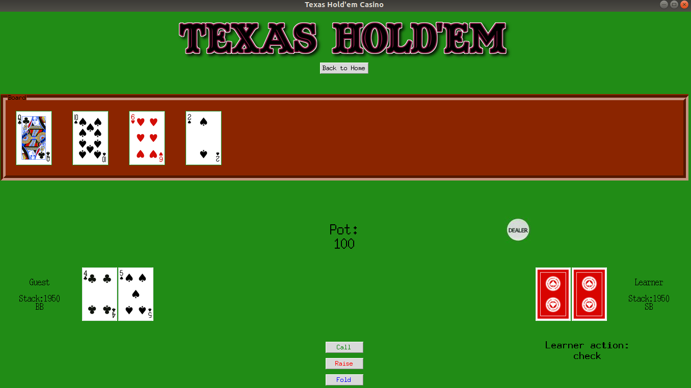
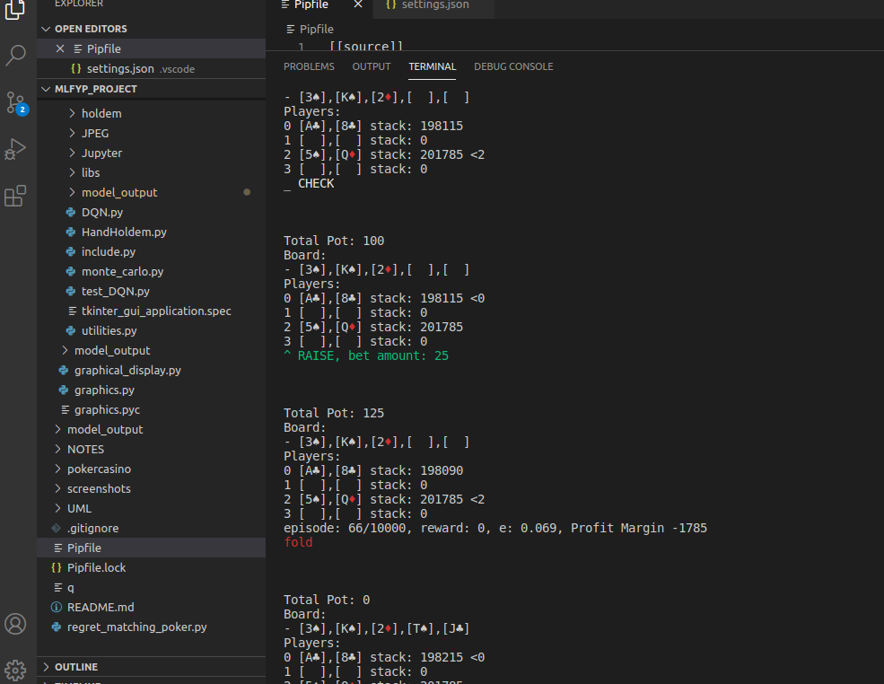

# Poker Bot Using Model-free Deep Reinforcement Learning Algorithms

[Link to main code](https://github.com/garyjh126/MLFYP_Project/tree/master/main_files/holdem "Named link title")

[My Dissertation *Building Poker Agent Using Reinforcement Learning*](https://drive.google.com/file/d/1s_U-9vSjbGeQGAQQIKFpax9t-2DY2SOl/view?usp=sharing "Named link title") 

## Requirements ##

    pip install gym
    pip install treys
    pip install keras

Ubuntu 18.04

Python 3.7.1

## Instructions ##

To run the GUI, navigate to [this directory](https://github.com/garyjh126/MLFYP_Project/tree/master/main_files/holdem/GUI "GUI"), and run:

     python tkinter_gui_application.py

The code can be run from the DQN.py script [here](https://github.com/garyjh126/MLFYP_Project/tree/master/main_files/holdem "Named link title"). The Monte-Carlo simulation can also be run here. 
    
**Example**

     python monte_carlo.py
     python DQN.py
   
A graphical rendering will appear with the game played to 1000 episodes. The learner agent is at seat 0 by default.

Alternatively, to review the DQN in google colab, go to [this open Jupyter Notebook](https://colab.research.google.com/drive/1L_fNNEGkZcBInyVv-br1gUkMOh7sWYYZ "Named link title"), and click 'Open in Playground'. Run all the cells in the notebook and observe the output. Rendering can be switched on and off.
     
 ### Changing Hyperparameters ###
 
 The hyperparameters can be changed from within the text editor if the user wants to disable rendering etc. By default, they are set in both monte_carlo.py and DQN.py as follows: 
 
 
 
 

### Tkinter GUI enables users to play against various agent types ###
 
 
### Terminal displaying hands being played by the AI bot ###
 
 

# Background

Poker is recognised as the quintessential game of imperfect information. Researchers around
the world have explored the depths of problems associated with solving such games and only a
handful have been successful in applying their methods to the game of poker. The recent
success of researchers sparked global interest and serves as the context for building a poker
bot in today’s climate. Contained in this project report will be a discussion about the research
carried out in solving the game of Limit Texas Hold’em and a personal pursuit in building a bot
that can do something similar.
The main purpose of this project is to test applications of deep reinforcement learning methods
on an imperfect information environment, to derive results, and hopefully build an intelligent
poker bot in the process.

The project is inspired by the work of the students and teachers at the [University of Alberta](http://poker.cs.ualberta.ca/). The project set out here was named [Cepheus](http://poker.srv.ualberta.ca/). I also take inspiration from other ambitious projects which set out to solve No limit Texas Hold 'em which has extended complications due to the continuous range of betting values; hence the label 'No limit'. Such projects include [Deepstack](https://matchpoker.net/deepstack-ai/) and [Libratus](https://www.cs.cmu.edu/~noamb/papers/17-IJCAI-Libratus.pdf).
## Cepheus – AI playing Limit Texas Hold’em Poker

Even though the titles of the research papers claim solving poker – formally it was essentially solved. Essentially solving Heads Up Limit* Texas Hold’em meant researchers were able to come up with an approximation (indistinguishable from original one for human during a lifetime) of a strategy profile coined 'Nash Equilibrium'. In two person zero-sum games playing a strategy from a Nash Equilibrium is also the best any player can do in case of no knowledge of his opponent’s strategy.

## DeepStack 

Around 2 years after Cepheus, another successful poker bot was revealed – this time it could win against humans in no limit version of Heads Up Texas Hold’em. Its name was DeepStack and it used continual re-solving aided by neural networks as a core.

Re-solving is one of the **subgame solving techniques**. Subgame is a game tree rooted in current decision point. From the very high-level view then subgame solving means solving a subgame in separation from the parent nodes. In other words re-solving is a technique to reconstruct a strategy profile for only the remainder of the game at given decision point.

Creators of Deepstack used **continual re-solving** where only two vectors were maintained throughout the game. The two vectors turned out to be sufficient to continuously reconstruct a strategy profile that approximates Nash Equilibrium in a current subgame (decision point). 

## Approach to Problem

The solution carried out in this project has been developed by using an incremental build
approach. The final application consists of a model-free deep reinforcement learning algorithm,
and a Monte-Carlo simulation that works in an environment of two bots. The first bot serves as
the benchmark agent as used in that simply plays actions according to both the public game
state and their own private hole cards. The second bot acts as the ‘learner’ that learns to orient
its own strategy according to the environment. The environment feeds rewards to the learner
agent as a way of incentivising actions that performed well in a particular state. In the case of
poker, optimal results are those which lead to building a higher profit margin. The agent must
learn the optimal policy which determines the best path for an agent to take. A policy simply
maps a state to an action.
Solutions are tested using a unique approach taken by the researchers at the University of
Alberta. This approach is called Counterfactual Regret Minimization (CFR), a self-play
iterative algorithm that learns by accumulating regret for each action at each decision point.
Acting as an initial approach, CFR was soon replaced by the idea of using deep reinforcement
learning in the hopes that deep learning could solve the problem. In Q-learning, a Neural
network acts as the agent that learns to map state-action pairs to rewards, thereby enabling a
bot to learn the optimal Q-function ‘ Q * ( s, a ) ’,​ and returning the policy that was associated with
such high rewards.
